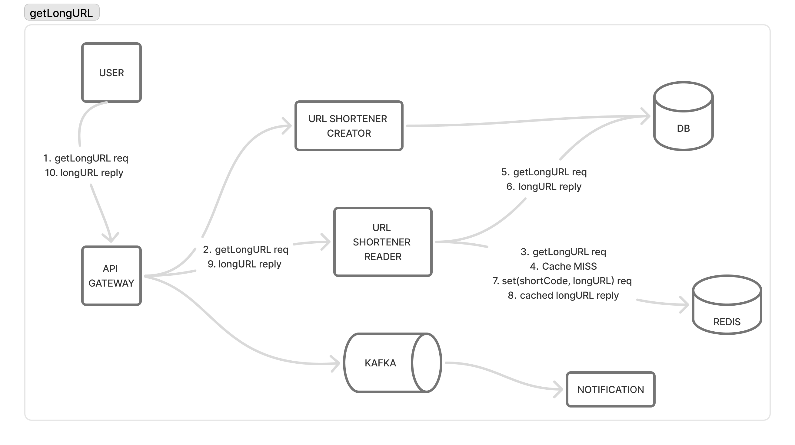

# URL Shortener Microservices

A distributed URL shortener built with Go microservice architecture (gRPC, Redis, PostgreSQL, Kafka).

This project was built following system design principles from this excellent YouTube video: [System Design Interview: URL Shortener (like bit.ly)](https://www.youtube.com/watch?v=iUU4O1sWtJA&t=2815s)

## Architecture

- **api-gateway**: REST API server (port 8080) - handles HTTP requests and routes to gRPC services
- **auth**: gRPC authentication service (port 50051) - user management and JWT tokens
- **url-gen**: gRPC URL generation service (port 50052) - creates short URLs
- **url-read**: gRPC URL reading service (port 50053) - resolves short URLs and tracks clicks

## API Endpoints

The API Gateway exposes two main REST endpoints:

##### POST /create
Creates a new short URL from a long URL.

**Request:**
```json
{
  "longUrl": "https://example.com/very/long/url",
  "expiresIn": 7
}
```

**Response:**
```json
{
  "shortUrl": "l.it/ABC123X",
  "expiration": "2025-10-10T12:00:00Z"
}
```

##### GET /{shortCode}
Retrieves and redirects to the original long URL.

**Request:**
```
GET /ABC123X
```

**Response:**
- **302 Found**: Redirects to the original long URL
- **404 Not Found**: Short code doesn't exist
- **410 Gone**: Short URL has expired

## GetLongURL Architecture Flow

The `getLongURL` operation follows a cache-first architecture to ensure optimal performance and minimal database load:



### Flow Steps:

1. **HTTP Request**: Client makes a GET request to `l.it/{shortCode}`
2. **API Gateway**: 
   - Receives HTTP request on port 8080
   - Validates the short code format (7 characters)
   - Extracts short code from URL path
   - Makes gRPC call to url-read service

3. **URL-Read Service** (Cache-First Strategy):
   - **Cache Check**: First attempts to retrieve URL from Redis cache
   - **Cache Hit**: If found in cache, returns immediately with cached data
   - **Cache Miss**: If not in cache, proceeds to database lookup
   - **Database Query**: Queries PostgreSQL for the original URL
   - **Cache Update**: Stores retrieved URL in Redis for future requests
   - Returns response to API Gateway

4. **Response Processing**:
   - API Gateway checks URL expiration
   - If expired, returns 410 Gone status
   - If valid, performs HTTP 302 redirect to original URL

### Performance Benefits:
- **Reduced Latency**: Cache hits avoid database queries
- **Database Load Reduction**: Frequently accessed URLs served from cache
- **Scalability**: Redis cache can handle high read throughput

### Cache Strategy:
- URLs are cached after first database retrieval
- Cache includes both the long URL and expiration timestamp
- Failed cache operations don't fail the request (graceful degradation)

## Local Development with Docker Compose

Requirements:
- Docker
- Docker Compose

```
# Start all services
make up

# Add domain mapping to resolve l.it to localhost (required for testing)
# Edit /etc/hosts file: sudo vim /etc/hosts
# Add this line: 127.0.0.1 l.it
# This allows generated URLs like http://l.it/TRDZip6 to work locally

# Run tests
bash scripts/test.sh

# Use curl to create short URL
curl -s -X POST -H "Content-Type: application/json" -d '{"longUrl": "https://protobuf.dev/getting-started/gotutorial/", "expiresIn": 1}' http://l.it/create

# Use curl to get Long URL
curl -I http://l.it/TRDZip6

# Tear down services
make down
```